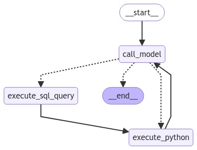

# README

WATCH THE DEMO: https://www.youtube.com/watch?v=uGqmn2xdU54

This repository is based on the code from LangChain's Azure Container Apps Dynamic Sessions Data Analyst Notebook (https://github.com/langchain-ai/langchain/blob/master/cookbook/azure_container_apps_dynamic_sessions_data_analyst.ipynb), where an agent reads data from a PostgreSQL database, saves it in a CSV file, and executes code based on the CSV file, such as plotting a graph.

The main feature of the code was that it executed code in a container using Azure Container Apps dynamic sessions.

This project replaces the Azure Container Apps dynamic sessions with docker. So when the agent executes the code, it will create a docker container, execute the code, and then remove the container. This ensures that the host machine is safe from arbitrary code from the agent.

The agent architecture is as follows:



After the execute_sql_query node is executed, the data is saved as a CSV on the host machine. The Docker container then has read-only permission to access this CSV. If it plots anything, the image is passed back to the host machine via a Base64 string.


## Setup Instructions

1. Clone the repository:


```python
git clone https://github.com/paulomuraroferreira/LLM-agents-with-docker.git
cd LLM-agents-with-docker
```

2. Install Dependencies:

```python
$pip install -e .
```

Also, ensure you have Docker installed and running.

3. Environment Configuration:

Create a .env file and fill the following environment variables:

```python
OPENAI_API_KEY=your_openai_api_key
DATABASE_URL=your_postgres_url
LLM_MODEL=i am using 'gpt-4o'
```

4. Run the Application:

Execute the main script to initialize the workflow and handle user queries:

```python
python main.py
```
